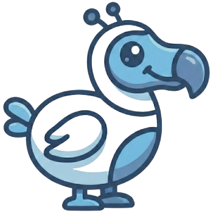

<p align="center">
  
</p>

<h1 align="center">Dodi</h1>

<p align="center">
  A personalized, AI-powered learning platform for kids — guided by <strong>Dodi</strong>, a friendly blue robot dodo bird.
</p>

---

## What is Dodi?

Dodi turns screen time into personalized, playful education. At its center is **Dodi**, a blue robot dodo bird companion who talks with kids (by text or voice), builds educational games tailored to each child, and adapts its language, tone, and difficulty to the child's age, skills, and interests.

Parents stay fully in control through a PIN-protected configuration view: they craft and assign Dodi's personality, choose the AI providers and models, and can read or edit everything the companion has learned. Kids get a deliberately minimal, playful interface where Dodi drives the navigation and interaction.

## Highlights

- 🦤 **Dodi companion** — an animated mascot with text and voice chat that adapts to each child.
- 🎮 **AI-generated games** — educational exercises generated as HTML/CSS/JS and run inside a locked-down sandboxed iframe.
- 🧠 **Living memory** — the companion keeps a markdown "memory dossier" per child (an AI-agentic-first design) that parents can read and edit as plain text.
- 🧑‍🤝‍🧑 **Friends** — kids connect via name tags / QR codes and share games, exchanged as end-to-end-encrypted friend cards.
- 🔐 **Privacy-first** — sensitive profile and social data is end-to-end encrypted and provider-blind, built on post-quantum-ready cryptography.
- 🌍 **Pluggable AI** — provider adapters (Anthropic, Google Gemini) selected per account.
- 🗣️ **Internationalized** — English and German out of the box.

See [`PROJECT.md`](PROJECT.md) for the full product specification and [`CLAUDE.md`](CLAUDE.md) for engineering guidelines.

## Tech stack

Next.js (App Router) · React 19 · TypeScript · Tailwind CSS · shadcn/ui · Supabase, organized as a pnpm + Turborepo monorepo:

```
clients/web   — kid- and parent-facing Next.js app
platform      — backend-for-frontend, API routes, AI proxy, Supabase migrations
core/*        — shared packages: ai, games, crypto, vault, protocol, types
```

## License

Dodi is free software, licensed under the **GNU Affero General Public License v3.0** — see [`LICENSE`](LICENSE) (SPDX: `AGPL-3.0-only`).

You are free to use, study, modify, and self-host Dodi, including running a private instance for your own family and friends. Because Dodi is a network application, the AGPL's **section 13** applies: if you run a modified version and make it available to others over a network, you must also offer those users the complete corresponding source code of your modified version.

Built with ❤️ by Alexander Birke & family for other families around the world.
