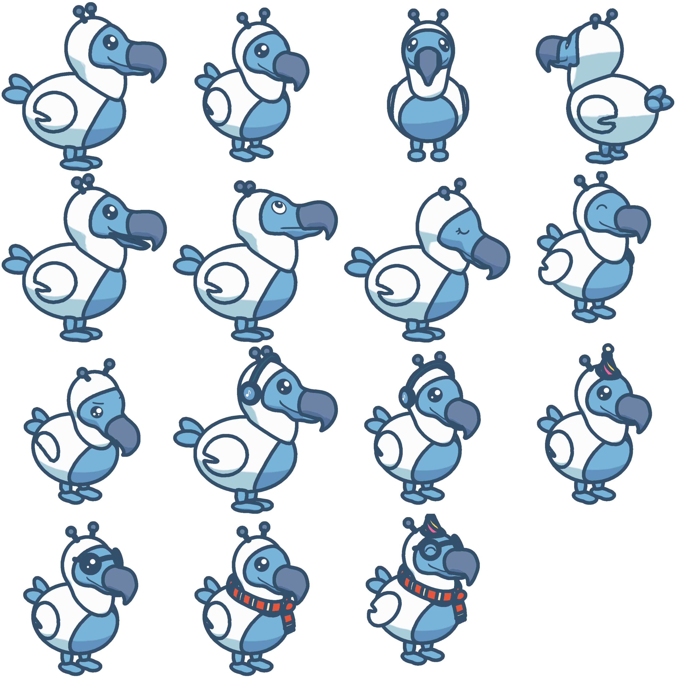

# Characters

3D characters for the companion. For now there is one: the stock **dodi**, a
3D version of the 2D artwork in `assets/reference/dodi_full.png`, built
procedurally in Blender so it can be regenerated and tweaked from code.



## Layout

| Path | What it is |
|---|---|
| `blender/build_dodi.py` | Builds the stock dodi: meshes, rig, face, sockets, clips. The source of truth. |
| `blender/build_headphones.py` | Builds the headphones accessory, fitted to dodi's head with ray casts. |
| `blender/build_party_hat.py`, `build_glasses.py`, `build_scarf.py` | Build the party hat, glasses and scarf accessories, each fitted to dodi with ray casts. |
| `blender/attach_preview.py` | Exports a character wearing accessories as one `.glb`, for review in a viewer. |
| `blender/kit.py` | Modelling helpers: metaball blobs, face patches and morphs, painted regions, rig, clips. |
| `blender/sdf.py` | Distance fields and a surface-nets mesher, for shapes metaballs cannot make (the head and beak). |
| `blender/face_atlas.py` | Draws the eye and mouth atlas as anti-aliased vector shapes (numpy). |
| `blender/preview.py` | Toon-shaded, outlined preview renders; `compare*.png` sits next to the 2D art. |
| `preview-all.sh` | Renders the standard preview set and `previews/overview.png`. |
| `validate.py` | Checks a `.glb` against the format below (plain `python3`, no dependencies). |
| `tests/face_morphs.py` | Imports the `.glb` and checks blended expressions never leave the face blank or cut by the skin. |
| `tests/atlas_bleed.py` | Imports the `.glb` and checks no face picture picks up colour from a neighbouring atlas cell. |
| `tests/mouth_open.py` | Imports the `.glb`, opens the jaw and checks the beak is see-through from the side, dark inside from the front and below, and never shows another part. |
| `tests/accessory_fit.py` | Puts each accessory on its socket and checks it touches the head, isn't buried, clears the antennae and keeps its marked parts off the skin, at rest, through every clip and with the jaw wide open. |
| `dodi/dodi.glb` | The runtime asset. |
| `dodi/face-atlas.png` | Every face state (also embedded in the `.glb`). |
| `dodi/dodi.blend` | Built alongside the `.glb` for inspection in Blender (gitignored). |
| `dodi/previews/dodi-headphones.glb`, `dodi-dressed.glb` | dodi wearing the headphones, and the party hat, glasses and scarf together, for gltf-viewer (gitignored, made by `preview-all.sh`). |
| `accessories/headphones/headphones.glb` | The headphones accessory (the "deaf" state). |
| `accessories/headphones/note.png` | The note on the ear cups (also embedded in the `.glb`). |
| `accessories/party_hat/party_hat.glb`, `accessories/glasses/glasses.glb`, `accessories/scarf/scarf.glb` | The kid-selectable accessories. |
| `../clients/web/public/characters/`, `../clients/mobile/assets/characters/` | Copies the builds write for the apps to load (`dodi.glb`, `accessories/<name>.glb`); `core/character`'s tests fail when they drift. |

## In the app

The renderer is `core/character` (`@dodi/character`, plain three.js, no DOM):
toon shading from `shade_color` (`toon-materials.ts`), outlines from a part-ID
and depth pass like the previews (`outline-pass.ts`; an inverted hull,
`hull-outline.ts`, where a GL driver cannot run it), the state table below
(`character-pose.ts`) and the stage that cross-fades clips and moves the jaw
with the voice loudness (`character-stage.ts`). The web binds it in
`clients/web/src/lib/character/` (one shared canvas that moves between views)
and `components/dodi/dodi-character-3d.tsx` lazy-loads it when the account's
"3D character" setting is on; the app draws it with expo-gl in
`clients/mobile/src/components/dodi/character-3d.tsx`. For now only the kid
home asks for it (`canRender3d`). Antenna springs and extra random blinks are not done yet.

## Build

Needs Blender 5.2+ on the `PATH` (the scripts use its bundled numpy). From `dodi-app/`:

```sh
blender --background --python-exit-code 1 --python characters/blender/build_dodi.py         # ~10 s
for a in headphones party_hat glasses scarf; do                                              # after dodi: fit to it
  blender --background --python-exit-code 1 --python characters/blender/build_$a.py
done
python3 characters/validate.py characters/dodi/dodi.glb
for a in headphones party_hat glasses scarf; do
  python3 characters/validate.py characters/accessories/$a/$a.glb
done
for t in face_morphs atlas_bleed mouth_open accessory_fit; do
  blender --background --python-exit-code 1 --python characters/tests/$t.py
done
sh characters/preview-all.sh                                                                 # ~25 s
```

Open `characters/dodi/dodi.blend` in Blender to look around: Space plays the
`idle` clip, and the other clips are NLA tracks (unmute one to see it).

Generic glTF viewers such as gltf-viewer.donmccurdy.com play the clips with
their expressions, and their morph target panel switches faces by hand. They
draw plain PBR lighting without outlines: toon shading and outlines are the
app renderer's job. Viewers open one file at a time, so to see the headphones
on dodi open `dodi/previews/dodi-headphones.glb` and play `deaf`; the party
hat, glasses and scarf are worn together in `dodi/previews/dodi-dressed.glb`.

A single preview: `blender --background characters/dodi/dodi.blend --python characters/blender/preview.py -- --views hero --pose think:0 --suffix=-think` (`--face eyes:mouth` forces an expression, `--jaw 12` opens the mouth, `--accessory PATH.glb` puts an accessory on).

## Character format, version 1

A character is one glTF 2.0 binary (`.glb`). Anything that follows these
conventions works with the runtime, whether it comes from this script, an
artist or an upload.

### Space and budget

- glTF axes: Y up, the character faces +Z, feet on y = 0, about 1 unit tall.
  (In Blender: Z up, facing -Y. The exporter converts.)
- At most 20k triangles, 3 MB and 1024 px per texture.
- Flat colours with no baked lighting. The renderer adds toon shading and outlines.

### Materials

The base colour is the lit tone. Material `extras`:

- `shade_color` (`"#rrggbb"`): the toon shadow tone (white suit → pale blue, not grey).
- `unlit: true`: draw the texture as is. Used by the face.

### Skeleton

- Required bones: `root`, `body`, `neck`, `head`.
- Optional bones the runtime uses when present: `jaw`, `tail`, `wing_L/R`,
  `leg_L/R`, `foot_L/R`, `antenna_L/R`.
- Every bone has an identity rest rotation, so code can rotate bones in the
  character's frame: local X is left and right (positive nods forward), Y is up
  (positive turns to the character's left), Z is forward.
- Parts are either skinned (hood, legs) or hang rigidly under a bone node (everything else).

### Face

- One mesh named `face`, rigidly under the head bone, holds every expression.
  It uses one atlas texture (material `face`, unlit and alpha-blended).
- Every state that is not the default is a morph target named
  `<part>_<state>`, e.g. `eyes_closed` or `mouth_neutral`. The base shape
  shows the defaults.
- Eyes are pictures from the atlas. The mouth is a painted stroke per
  expression: the gape, whose front runs along the beak's lower edge and then
  back into the cheek, so the smile reads as the beak's line continuing (as
  in the 2D art), not as a second mouth. `smile` curls up at the cheek,
  `neutral` runs straight, `frown` curls down.
- Every picture keeps its full size. A shown one floats 1.4 mm above the
  skin; a hidden one waits 0.6 mm under it. The mouth strokes are thin and
  can lie right along the head's outline (in the sleep pose), where a lift
  shows as a sliver past it, so they sit closer: 0.6 mm above, 0.25 mm under.
  A state's morph target lifts its own pictures out and sinks the part's
  default ones.
- Show one state per part by setting its weight to 1. Because the lift is
  larger than the depth, both pictures are out during the middle of a blend
  (from about 0.3 to 0.7 of the way), so when two clips play at once or
  cross-fade, e.g. 50% sleep and 50% happy, the face never goes blank.
  `tests/face_morphs.py` checks this on the exported file.
- Default morph weights must be 0, so any viewer shows the default face at rest.
- The stock states are:
  - eyes: `open`, `closed`, `up`, `happy`, `sad`
  - mouth: `smile`, `neutral`, `frown`

### Markings

Colour patches such as the blue belly are extra materials on the same mesh,
cut along a smooth contour. They sit flush with the surface; nothing bulges out.

### Jaw, springs and sockets

- **Jaw:** the lower jaw is the blue part of the head below the gape, in
  front of the mouth corner. The head is torn open along the gape there and
  the part below is skinned to the `jaw` bone, hinged at the corner, so the
  mouth opens exactly along the painted line. Both sides of the tear are
  closed inside by flat caps in the dark-blue `mouth` material: a roof under
  the upper beak and a floor on the jaw, meeting on a hinge line across the
  back of the mouth. Opened, the gap between them is empty: from the side you
  look straight through the open beak, from the front or below you see its
  dark inside, never the hollow head or the neck. At rest the caps touch
  inside the closed head and cannot be seen. Voice loudness from 0 to 1 maps
  to a rotation from 0 to `open_degrees` around the jaw bone's X axis.
  Positive opens.
- **Springs:** bones that get secondary motion in code (the antennae wobble).
- **Sockets:** empty nodes under bones that accessories attach to. They sit
  in the character's orientation at rest:
  - `socket_head_top`: hats
  - `socket_eyes`: glasses
  - `socket_ears`: headphones
  - `socket_neck`: scarves
  - `socket_back`: backpacks

  See [Accessories](#accessories) for what goes on them.

### Clips

- Looping animations: `idle` (required), `listen`, `think`, `talk`, `sleep`,
  `happy`, `sad` (slumped with a sigh, for hunger and other sad moments) and
  `deaf` (bobbing to music, worn with the headphones).
- Each clip keys every bone it moves (rotation and translation) and all face
  morph weights, so it carries its own expression and clips cross-fade
  cleanly. `idle` blinks once per loop.
- Code adds what a clip cannot know: the jaw following the voice, antenna
  springs and extra random blinks. It writes them after the mixer update, so
  they override the clip. `talk` carries a jaw fallback for viewers without code.
- In Blender, each clip is an NLA track on the armature plus a same-named
  track on the face's shape keys. The exporter's NLA mode merges them into one
  glTF animation.

### Tricks are not clips

Tricks (the pirouette and the other one-shot moves, built-in or custom) are
not glTF clips and are not in the `.glb`. They are motion scripts: small
JSON-like data, a list of timed poses giving bone rotations in degrees (and
root offsets) in the character's frame, plus the face state to show. They live
in `core/character/src/tricks/<model>.ts` (`dodi.ts` for the stock dodi) and
`core/character/src/motion-clip.ts` turns them into animation clips at
runtime. A model needs nothing extra for tricks to work: its bones only have
to follow the skeleton conventions above (names and identity rest rotations).

### Manifest

The scene `extras.character` holds a JSON string. It is a string because
Blender custom properties cannot store lists of strings.

```json
{
  "format": "character", "version": 1, "name": "dodi", "height": 1.0,
  "outline": { "color": "#34506a", "width": 0.012 },
  "face": {
    "eyes": ["open", "closed", "up", "happy", "sad"],
    "mouth": ["smile", "neutral", "frown"],
    "default": { "eyes": "open", "mouth": "smile" },
    "blink": "closed"
  },
  "jaw": { "bone": "jaw", "axis": "x", "open_degrees": 14 },
  "springs": ["antenna_L", "antenna_R"],
  "clips": ["idle", "listen", "think", "talk", "sleep", "happy", "sad", "deaf"],
  "sockets": ["socket_head_top", "socket_eyes", "socket_ears", "socket_neck", "socket_back"]
}
```

### Accessories

An accessory (headphones, a hat, glasses) is its own `.glb` that rides on one
of a character's sockets.

- Scene `extras.accessory` holds a JSON string:
  `{"format": "accessory", "version": 1, "name": "headphones", "socket": "socket_ears", "fitted_to": "dodi"}`.
- An empty node named `attach` sits at the accessory's origin with no
  rotation. The app puts the accessory's root under the socket node, so
  `attach` lands exactly on the socket, in the character's orientation.
- Accessories are static props (no skin, no clips): they follow the bone
  their socket hangs on. Materials follow the character rules (`shade_color`,
  or `unlit` for decals such as the note on the ear cups).
- At most 8k triangles, 1 MB and 512 px per texture.
- Optional: a part's node `extras.clearance` (metres) is the gap it must keep
  from the character's skin; `tests/accessory_fit.py` checks it (the glasses'
  rims and bridge use it). The runtime ignores it.
- `fitted_to` names the character it was shaped for. The stock accessories
  are fitted to dodi's head; another character may need its own fit.

Every stock accessory is built by its own `build_<name>.py`, which imports the
exported dodi and fits the prop to its real surface with ray casts:

| Accessory | Socket | How it is fitted |
|---|---|---|
| `headphones` | `socket_ears` | The cushions press a few millimetres into the hood so they read as touching; the band runs over the middle of the head, leaning a little forward so it passes in front of the antennae (tilted back, it looked like it would slip off). |
| `party_hat` | `socket_head_top` | A pink cone with spiral yellow stripes (a painted region, cut exactly along the stripes), a cream roll round the rim and a pompom. It stands on the crown in front of the antennae, tipped forward and to the character's right; its rim is dropped onto the hood ray by ray, so it sits on the curved head instead of on a flat base. |
| `glasses` | `socket_eyes` | Round red frames, no lenses. dodi's eyes sit on the sides of the head, so each rim faces along its own eye (turned a little to the front) and is pushed out until the whole ring clears the face and beak by 3.5 mm; the bridge arches over the snout and the temples run back along the head to rest on the hood. The rims and bridge carry `clearance` in their extras so the test keeps them off the face. |
| `scarf` | `socket_neck` | A chunky ribbed scarf with cream stripes, a knot and one short end with tassels hanging down the chest. The loop follows the tilted collar where the neck meets the body. It rides on the neck bone while the head, body and skinned hood move on their own, so it is fitted against the character in every pose of every clip (moved into the socket's frame), not just at rest. |

`tests/accessory_fit.py` keeps them that way, for every clip and with the jaw
wide open. Tricks (motion scripts played at runtime) are not checked by it.

### How app states map onto a character

Eyes and mouth come with the clip.

| Companion state | Clip | Eyes | Mouth |
|---|---|---|---|
| listening | `listen` | `open` | `smile` |
| speaking | `talk`, jaw from audio level | `open` | `smile` |
| thinking | `think` | `up` | `neutral` |
| sleep / disconnected | `sleep` | `closed` | `neutral` |
| deaf (the kid muted dodi) | `deaf` + headphones on `socket_ears` | `open` | `smile` |
| happy (treats, later) | `happy` | `happy` | `smile` |
| sad, hungry (later) | `sad` | `sad` | `frown` |

## How the stock dodi is made

- **Measurements.** Proportions are measured from the 2D art at 340 px = 1 unit.
  `previews/compare.png` overlays the render on the art from the same angle.
- **Parts.** Most parts (body, hood with neck, wings, tail feathers, legs,
  feet, antennae) are a few metaball ellipsoids polygonised into one mesh.
  Blobs inside a part melt into soft joins, while separate parts meet at a
  hard edge, which is where the 2D art draws its lines. The belly is painted
  onto the body where it lies inside an ellipsoid.
- **Head and beak.** These are one distance-field surface (`head_field`):
  skull, snout and chin, joined with rounded blends to the beak. The beak is
  its side view (`BEAK_OUTLINE`: flat top, one arc over the front, the hook's
  point) puffed out sideways with rounded edges, narrowing towards the tip
  (`beak_width`). Its colour is painted on (`beak_region`), so the snout runs
  into the beak without a step. The head is shaded with the exact normals of
  the shape, so it stays smooth after the mesh is reduced.
- **Mouth.** `GAPE` in `build_dodi.py` is the mouth line in side view. It
  places the stroke (projected onto the head and beak), the tear with its
  caps (`rig_head`, `kit.tear_open`; the gape is cut before the face is
  projected) and the hinge, so all three always agree.
- **Previews.** The renders emulate the intended runtime look:
  - two-tone toon colours from `base_color` / `shade_color`,
  - outlines found by edge detection on a per-part (per-material) ID render
    plus a depth render.

  The web renderer should draw its lines the same way (a part-ID buffer), not
  with inverted hulls, so the lines where parts meet appear too.

## Handing over to an artist

Give them `dodi.blend`, this README and `previews/`. Once someone edits the
`.blend` by hand, it becomes the source: stop running `build_dodi.py`, export
with the same glTF settings (see the end of `build_dodi.py`) and run
`validate.py` on the result.
